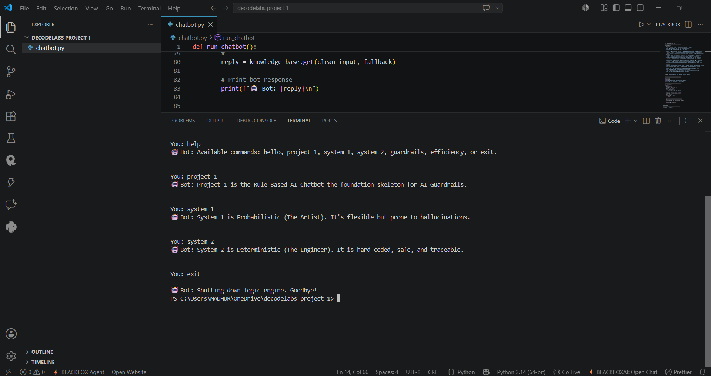

# Task-1-Madhur-decodes
Rule-Based AI Chatbot 

## 📷 Demo Output

A simple, terminal-based chatbot built in Python using rule-based logic. It demonstrates core control-flow and decision-making concepts along with basic AI ideas like deterministic vs. probabilistic responses.

## 🚀 Key Feature: O(1) Efficiency
 It uses predefined rules to generate responses.
 By leveraging the `.get()` method, the chatbot achieves a constant **$O(1)$ lookup time**, ensuring instantaneous responses regardless of how many rules or intents   are added to the system.

## 🛠️ Tech Stack & Concepts
* **Language:** Python 3.x
* **Data Structures:** Python Dictionaries
* **Concepts covered:** Control Flow, Decision making, Deterministic and Probabilistic AI, Time complexity O(1)

## 📦 Installation & Usage
1. **Repository cloning**
      '''bash
      git clone [https://github.com/madhur-B/Task-1-Madhur-decodes.git]
